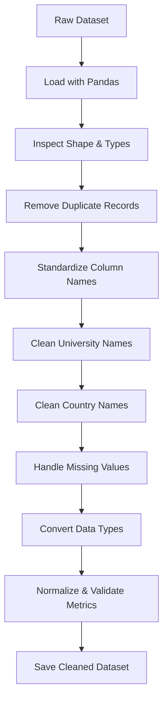
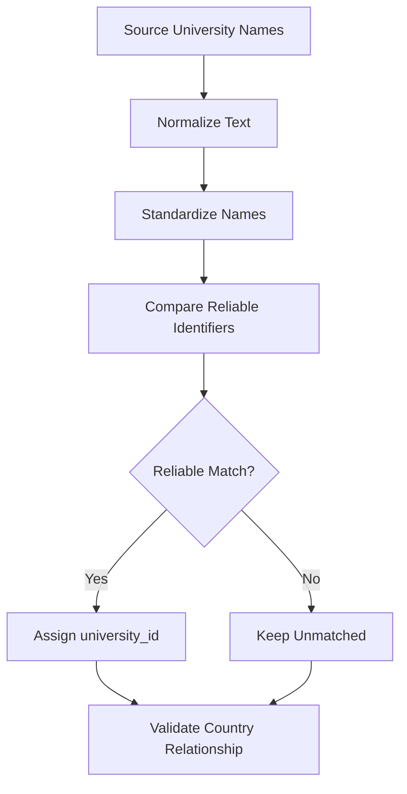
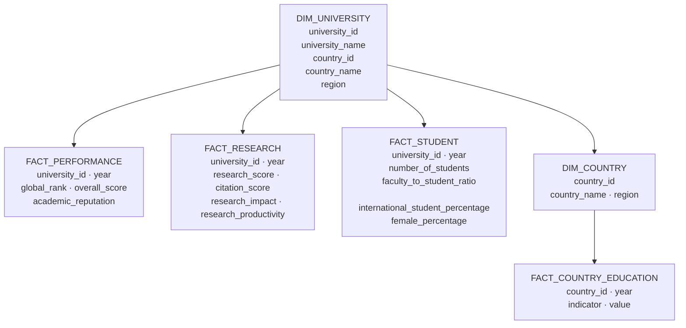
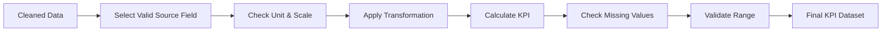
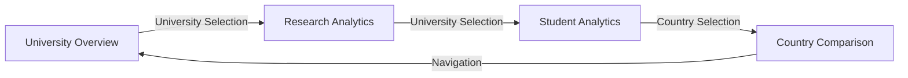
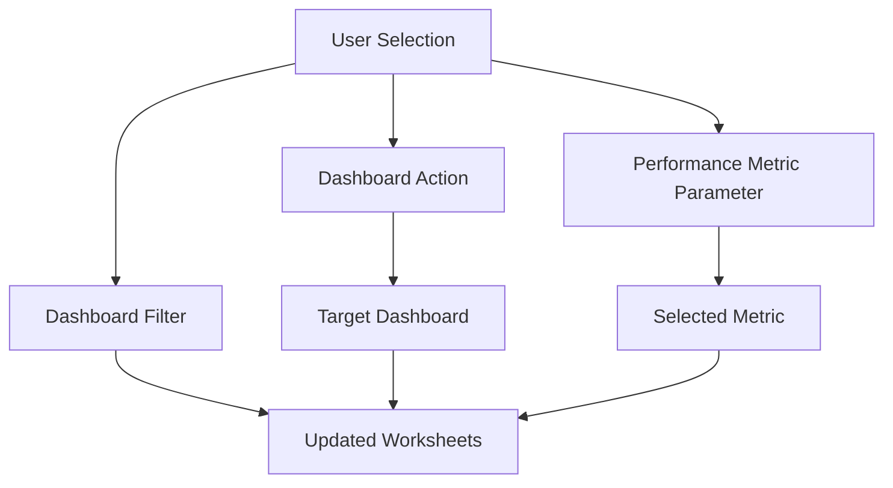
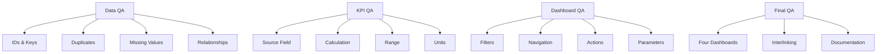
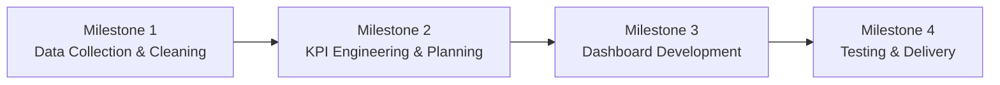
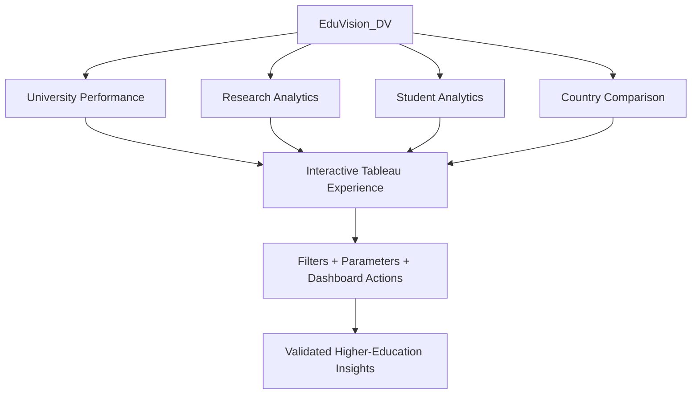

# EduVision\_DV — Final Documentation

## Higher Education Performance & Intelligence Dashboard

*A unified Tableau analytics system for university performance, research analytics, student analytics, and country-level education benchmarking.*

---

| Item | Details |
|------|---------|
| **Project** | EduVision\_DV — Higher Education Performance Dashboard |
| **Document** | Final Project Documentation |
| **Workbook** | `EduVision_DV.twbx` |
| **Report Date** | 2026-09-30 |
| **Document Version** | v1.0 |
| **Final Status** | ✅ PASS |

---

## 1. Executive Summary

EduVision\_DV transforms publicly available higher-education datasets into a structured analytical model and an interconnected Tableau dashboard suite.

The final system delivers **four integrated dashboards**:

| Dashboard | Analytical Focus |
|-----------|-----------------|
| **University Overview** | Institutional rankings, reputation, and overall performance |
| **Research Analytics** | Research impact, citation performance, and productivity |
| **Student Analytics** | Internationalization, faculty ratios, diversity, and enrolment |
| **Country Comparison** | Country benchmarking and regional education trends |

The project covers the complete analytical lifecycle: data collection → validation → cleaning → KPI engineering → dashboard development → integration → testing → documentation.

---

## 2. Project Objectives

- Analyse global university rankings and performance
- Compare academic reputation across institutions
- Analyse research impact, citations, and productivity
- Analyse student population, diversity, internationalization, and enrolment
- Compare country-level education performance and regional trends
- Build six major education KPIs with defined sources and calculation methods
- Provide interactive, interconnected Tableau dashboards
- Connect four dashboards through filters, navigation, parameters, and dashboard actions
- Produce a fully documented and portfolio-ready dashboard suite

---

## 3. End-to-End Architecture

```mermaid
flowchart LR
    A[Approved Datasets] --> B[Data Collection]
    B --> C[Validation]
    C --> D[Cleaning & Transformation]
    D --> E[Name Standardization]
    E --> F[Common IDs]
    F --> G[Analytical Data Model]
    G --> H[KPI Engineering]
    H --> I[Tableau Data]
    I --> J[Dashboard Development]
    J --> K[Dashboard Integration]
    K --> L[Testing & Validation]
    L --> M[Documentation & Delivery]
```



**Core workflow:**

```
Collect → Validate → Clean → Match → Model → Engineer KPIs
       → Visualize → Integrate → Test → Document
```

---

## 4. Dataset Strategy

Datasets are selected for specific analytical purposes. No dataset is blindly merged into a single flat table.

| Dataset | Main Purpose | Primary Dashboard |
|---------|-------------|-------------------|
| QS World University Rankings 2025 | University performance, ranking, and reputation indicators | University Overview |
| Times Higher Education Rankings 2024 | Research, teaching, citations, and international indicators | Research Analytics |
| World University Rankings 2023 | Student and research indicators | Student Analytics |
| World Bank Education Statistics | Country-level education benchmarking | Country Comparison |

### Data Hierarchy

```
University
    │
    ▼
Country
    │
    ▼
Country-level Education Indicators
```

University-level and country-level data have different granularities and are managed separately.

---

## 5. Data Collection

| Dataset | Rows | Columns |
|---------|:----:|:-------:|
| QS World University Rankings 2025 | 1,503 | 28 |
| THE World University Rankings 2024 | 2,673 | 29 |
| World University Rankings 2023 | 2,341 | 13 |

The collection stage preserves all source data without modification and prepares inputs for validation and cleaning.

---

## 6. Data Validation

Before cleaning, each dataset is assessed across the following dimensions:

| Category | Checks Performed |
|----------|-----------------|
| **Structural** | Dataset dimensions · Column names · University name fields · Country fields · Year fields |
| **Content** | Key indicator availability · Missing values · Duplicate rows · Duplicate universities · Data types |
| **Cross-dataset** | University match rate · Dataset completeness |

> **Important distinction:** University match rate (overlap between datasets) and dataset completeness (quality of required fields) are **different measurements** and are not conflated.
>
> Aggressive fuzzy matching is not used simply to inflate match percentages.

---

## 7. Data Cleaning Pipeline



### Cleaning Activities

| Activity | Description |
|----------|-------------|
| Deduplication | Remove duplicate records across all source datasets |
| University name standardization | Normalize casing, trim whitespace, resolve spelling variants |
| Country name standardization | Standardize country names and codes |
| Numeric field conversion | Convert string-encoded numbers to correct numeric types |
| Missing value analysis | Profile and document null patterns — no zero-substitution |
| Metric normalization | Normalize ranking-related metrics where required |
| Data validation | Range checks and format validation post-cleaning |

> **Rule:** Raw source datasets are never overwritten.

---

## 8. University and Country Matching



### Matching Principles

| Principle | Description |
|-----------|-------------|
| Normalize first | Standardize all names before any matching attempt |
| Reliable identifiers | Use `university_id` and `country_id` as primary keys |
| Country validation | Validate university-country relationships after matching |
| No forced matches | Uncertain or low-confidence matches are not forced |
| Duplicate check | Matched results are checked for duplicate assignments |

---

## 9. Common Identifiers

The analytical model uses three shared keys across all tables:

| Identifier | Description |
|------------|-------------|
| `university_id` | Primary institution identifier |
| `country_id` | Primary country identifier |
| `year` | Ranking or data year |

> **Rule:** University name alone is never used as a primary key. Common identifiers allow performance, research, student, and country datasets to join correctly and consistently.

---

## 10. Final Data Model



> **Why a structured model?** A large many-to-many join between multiple ranking datasets can multiply records and produce incorrect aggregations. Separate analytical tables with well-defined Tableau relationships prevent this problem.

---

## 11. KPI Framework

The project defines **six major KPIs**, each with a documented source, unit, calculation, missing-value treatment, and interpretation:

| # | KPI | Purpose | Scale |
|---|-----|---------|-------|
| 1 | **Global Ranking Score** | Ranking performance | 0 – 100 |
| 2 | **Research Impact Score** | Research and citation influence | 0 – 100 |
| 3 | **Faculty-to-Student Ratio** | Faculty-student relationship | Ratio |
| 4 | **International Student Percentage** | International student participation | % (0–100) |
| 5 | **Academic Reputation Score** | Academic reputation | 0 – 100 |
| 6 | **Research Productivity Index** | Research output and productivity | 0 – 100 |

> Full definitions, source fields, and calculation methods are documented in [`KPI_Defination.md`](KPI_Defination.md).

### KPI Rules

| Rule | Description |
|------|-------------|
| Source fidelity | Each KPI uses only its defined source field(s) |
| Unit preservation | A score stays a score · A percentage stays a percentage · A ratio stays a ratio |
| No fabrication | No synthetic or estimated values are introduced |
| Null preservation | Missing source values remain null — never substituted with zero |
| Transparency | All KPI formulas are documented and reproducible |

---

## 12. KPI Engineering Flow



---

## 13. Dashboard Suite Architecture



The four dashboards form an **integrated analytical system** rather than four independent dashboards.

---

## 14. University Overview

| Item | Details |
|------|---------|
| **Purpose** | Main landing dashboard for institutional performance analysis |

### KPI Cards
- Total Universities
- Average Global Ranking Score
- Average Overall Score
- Total Countries

### Visualizations

| Visual | Description |
|--------|-------------|
| Top University Rankings | Universities ranked by Global Ranking Score |
| Global University Distribution | Geographic distribution of universities |
| Academic Reputation Analysis | Academic Reputation Score comparison |
| University Performance Trends | Overall performance across ranking years |
| Institutional Comparison | Side-by-side institutional performance comparison |

### Filters: University · Country · Region · Ranking Year

---

## 15. Research Analytics

| Item | Details |
|------|---------|
| **Purpose** | Analyse university research performance, citations, impact, and productivity |

### KPI Cards
- Average Research Impact Score
- Average Citations Score
- Average Research Productivity
- Average Research Score

### Visualizations

| Visual | Description |
|--------|-------------|
| Top Research Institutions | Universities ranked by research performance |
| Research Impact Comparison | Research Impact Score comparison |
| Research Output Analysis | Uses Research Score as a transparent research-output proxy — publication counts are not fabricated |
| Citation Performance | Citation performance using Citations Score |
| Research Productivity Trends | Research Productivity Index across ranking years |

### Filters: University · Country · Ranking Year

---

## 16. Student Analytics

| Item | Details |
|------|---------|
| **Purpose** | Analyse student population, internationalization, diversity, faculty ratios, and enrolment |

### KPI Cards
- Average International Student Percentage
- Average Faculty-to-Student Ratio
- Average Female Percentage
- Average Number of Students

### Visualizations

| Visual | Description |
|--------|-------------|
| International Student Analysis | International student percentage across institutions |
| Faculty-to-Student Ratio Analysis | Faculty-to-student ratio comparison |
| Student Diversity Trends | Female percentage trends across ranking years |
| Enrollment Comparisons | Total student enrolment comparison |
| Student Distribution Analysis | Student distribution across countries |

### Filters: University · Country · Ranking Year

---

## 17. Country Comparison

| Item | Details |
|------|---------|
| **Purpose** | Country-level education benchmarking and regional trend analysis |

### KPI Cards
- Average Global Ranking Score
- Average Overall Score
- Average Research Impact Score
- Average International Student Percentage

### Visualizations

| Visual | Description |
|--------|-------------|
| Country Ranking Comparison | Country comparison using the user-selected Performance Metric |
| Education Performance Benchmarking | Country comparison using Research Impact Score |
| Regional Education Trends | Ranking score trends by geographic region |
| Top Performing Countries | Countries with highest Overall Score |
| University Distribution | University count per country |

### Performance Metric Parameter

| Option | Effect on Country Ranking Comparison |
|--------|--------------------------------------|
| Ranking Score | Displays Global Ranking Score |
| Overall Score | Displays Overall Score |
| Research Impact Score | Displays Research Impact Score |

### Filters: Country · Region · Ranking Year · University

---

## 18. Dashboard Interaction Architecture



### Interactive Features

| Feature | Description |
|---------|-------------|
| University filter | Filter all visuals to a selected institution |
| Country filter | Filter to a specific country |
| Region filter | Filter to a geographic region |
| Ranking Year filter | Filter to a specific year |
| Navigation buttons | Move between dashboards |
| Dashboard filter actions | Pass selected university or country to linked dashboards |
| Parameter action | Switch the Performance Metric in Country Comparison |
| Filter clearing | Clearing a selection resets the target dashboard to all records |

---

## 19. Interlinked User Journey

```
┌───────────────────────────────┐
│       University Overview     │
│   Select a university         │
└──────────────┬────────────────┘
               │ University passed
               ▼
┌───────────────────────────────┐
│       Research Analytics      │
│   Same university context     │
└──────────────┬────────────────┘
               │ University passed
               ▼
┌───────────────────────────────┐
│       Student Analytics       │
│   Same university context     │
└──────────────┬────────────────┘
               │ Country passed
               ▼
┌───────────────────────────────┐
│       Country Comparison      │
│   University's country        │
└───────────────────────────────┘
```

---

## 20. Dashboard Navigation Loop

```
University Overview
       ↓
Research Analytics
       ↓
Student Analytics
       ↓
Country Comparison
       ↓
University Overview  ← (loop back)
```

The navigation loop allows users to move through the complete analytical story and return to the start.

---

## 21. Testing & Validation Summary

All testing was performed under Module 7. No dashboards were modified during testing unless a confirmed error was identified.

### Testing Coverage

| Category | Items Validated |
|----------|----------------|
| KPI Validation | Global Ranking Score · Research Impact Score · Faculty-to-Student Ratio · International Student Percentage · Academic Reputation Score · Research Productivity Index |
| Ranking Validation | Global rank ordering · Normalized ranking · Ranking score relationship |
| Dashboard Filters | University · Country · Region · Ranking Year |
| Dashboard Linking | University Overview → Research Analytics → Student Analytics → Country Comparison |
| Parameter Action | Ranking Score · Overall Score · Research Impact Score |
| Navigation | Full navigation loop |
| Filter Clearing | Clear university → Research Analytics resets to all universities |
| Educational Metrics | Faculty-to-student ratio · International student % · Female % · Research impact · Citation performance · Research productivity |

### Final Test Results

| Test Category | Result |
|---------------|--------|
| KPI Validation | ✅ PASS (6/6 — 100%) |
| Ranking Validation | ✅ PASS |
| Dashboard Filters | ✅ PASS |
| Dashboard Linking | ✅ PASS |
| Parameter Action | ✅ PASS |
| Navigation | ✅ PASS |
| Filter Clearing | ✅ PASS |
| Educational Metrics | ✅ PASS |
| Dashboard Visuals | ✅ PASS |

> Full results are documented in [`QA_Checklist.md`](QA_Checklist.md) and [`Dashboard_Testing_Report.md`](Dashboard_Testing_Report.md).

---

## 22. Quality Assurance Framework



**Evaluation targets met:**
- ✅ No major dashboard issues
- ✅ KPI accuracy > 95% (achieved 100%)

---

## 23. Important Methodology Rules

| Rule | Description |
|------|-------------|
| Preserve raw data | Raw source datasets are never overwritten |
| No forced matching | Do not inflate match rates through aggressive fuzzy matching |
| No KPI substitution | Do not map an unrelated field as a KPI substitute |
| Unit fidelity | Do not treat a score as a percentage or ratio |
| Correct keys | Do not use University Name alone as a primary key |
| Avoid many-to-many joins | Use structured analytical tables to prevent record multiplication |
| Validate before building | Validate the data model before Tableau development |
| No fabrication | Do not create or estimate metrics that do not exist in the source data |

---

## 24. Limitations

| Limitation | Description |
|------------|-------------|
| **Different source coverage** | Each ranking dataset covers a different set of universities |
| **Match variation** | University overlap varies between sources |
| **Missing values** | Some analytical indicators contain null values in source data |
| **Data granularity** | University-level and country-level datasets represent different analytical levels |
| **Research Output** | No actual publication-count field exists in the finalized dataset; Research Score is used as a transparent proxy |
| **Source dependence** | Dashboard findings depend on the coverage, definitions, and quality of the underlying datasets |

---

## 25. Milestone Architecture



### Milestone Deliverables

| Milestone | Phase | Key Deliverables |
|-----------|-------|-----------------|
| **Milestone 1** | Data Collection & Preparation | `data_collection.py` · `university_raw_data.csv` · `education_cleaning.ipynb` · `university_cleaned.csv` |
| **Milestone 2** | KPI Engineering & Planning | `generate_education_kpis.py` · `university_final_dataset.xlsx` · `dashboard_storyboard.pdf` · `eduvision_prototype.twbx` |
| **Milestone 3** | Dashboard Development | `eduvision_prototype_v1.twbx` · `EduVision_DV.twbx` |
| **Milestone 4** | Testing & Project Delivery | QA Checklist · Dashboard Testing Report · Data Sources · KPI Definitions · Dashboard Guide · Education Analytics Methodology · Project Structure · Final Documentation |

---

## 26. Final Project Structure

```text
EduVision_DV/
│
├── data/
│   └── raw/
│       ├── QS World University Rankings 2025 (Top global universities).csv
│       ├── TIMES_WorldUniversityRankings_2024.csv
│       ├── World University Rankings 2023.csv
│       └── world_bank_education/
│           ├── EdStatsData.csv
│           ├── EdStatsSeries.csv
│           ├── EdStatsCountry.csv
│           ├── EdStatsCountry-Series.csv
│           └── EdStatsFootNote.csv
│
├── Milestone1/
│   ├── data_collection.py
│   ├── university_raw_data.csv
│   ├── education_cleaning.ipynb
│   └── university_cleaned.csv
│
├── Milestone2/
│   ├── generate_education_kpis.py
│   ├── university_final_dataset.xlsx
│   ├── dashboard_storyboard.pdf
│   ├── eduvision_prototype.twb
│   └── eduvision_prototype.twbx
│
├── Milestone3/
│   ├── eduvision_prototype_v1.twbx
│   └── EduVision_DV.twbx
│
├── Milestone4/
│   ├── QA_Checklist.md
│   ├── Dashboard_Testing_Report.md
│   ├── Data_Sources.md
│   ├── KPI_Defination.md
│   ├── Dashboard_guide.md
│   ├── Education_Analytics_Methodology.md
│   ├── Project_Structure.md
│   └── Final_Documentation.md
│
├── .gitignore
└── README.md
```

---

## 27. Technology Stack

| Area | Technology |
|------|-----------|
| Data Collection | Python |
| Data Processing | Pandas · NumPy |
| Data Cleaning | Python / Pandas |
| KPI Engineering | Python |
| Visualization | Tableau Desktop |
| Dashboard Integration | Tableau Filters · Parameters · Dashboard Actions |
| Documentation | Markdown |
| Version Control | Git / GitHub |

---

## 28. Final Deliverables

### Primary Tableau Deliverable

| File | Description |
|------|-------------|
| `EduVision_DV.twbx` | **Production Tableau workbook** — four integrated dashboards |

### Documentation Deliverables (Milestone 4)

| Document | Purpose |
|----------|---------|
| [`QA_Checklist.md`](QA_Checklist.md) | Module 7 QA test results |
| [`Dashboard_Testing_Report.md`](Dashboard_Testing_Report.md) | Full dashboard testing report |
| [`Data_Sources.md`](Data_Sources.md) | Dataset sources and field references |
| [`KPI_Defination.md`](KPI_Defination.md) | KPI definitions and calculation reference |
| [`Dashboard_guide.md`](Dashboard_guide.md) | Dashboard user and navigation guide |
| [`Education_Analytics_Methodology.md`](Education_Analytics_Methodology.md) | End-to-end project methodology |
| [`Project_Structure.md`](Project_Structure.md) | Project folder structure reference |
| [`Final_Documentation.md`](Final_Documentation.md) | This document — complete project reference |

---

## 29. Final Quality Checklist

### Data

- ✅ Data collected from all four sources
- ✅ Dataset validation completed
- ✅ University names standardized
- ✅ Country names standardized
- ✅ Common IDs (`university_id`, `country_id`, `year`) created
- ✅ Duplicate handling completed
- ✅ Missing values analyzed and preserved
- ✅ KPI source fields validated

### KPIs

- ✅ All six KPIs defined with source, unit, and formula
- ✅ KPI source fields identified and verified
- ✅ KPI calculations validated (6/6 — 100%)
- ✅ Ranking calculations validated
- ✅ Units verified for all KPIs
- ✅ No unrelated KPI field substitution

### Dashboards

- ✅ University Overview
- ✅ Research Analytics
- ✅ Student Analytics
- ✅ Country Comparison
- ✅ KPI cards on all dashboards
- ✅ Filters on all dashboards
- ✅ Navigation between all dashboards
- ✅ Dashboard linking (university and country passing)
- ✅ Parameter action (Performance Metric)
- ✅ Filter clearing behaviour

### Documentation

- ✅ Dataset sources
- ✅ KPI definitions
- ✅ Dashboard guide
- ✅ Education analytics methodology
- ✅ Project structure
- ✅ QA checklist
- ✅ Dashboard testing report
- ✅ Final documentation

---

## 30. Final Outcome



EduVision\_DV combines:

**Data Engineering + KPI Engineering + Tableau Visualization + Dashboard Integration + Validation + Documentation**

into one higher-education intelligence system.

---

## 31. Final Statement

EduVision\_DV provides a unified analytical view of higher education by connecting institutional performance, research output, student characteristics, and country-level education indicators through one interactive Tableau workbook.

| | |
|-|-|
| **Final Tableau Workbook** | `EduVision_DV.twbx` |
| **Final Dashboard Suite** | University Overview → Research Analytics → Student Analytics → Country Comparison |
| **Final Module 7 Status** | ✅ PASS |
| **KPI Validation** | 6 / 6 tested checks passed (100%) |

---

*EduVision\_DV — Transforming higher-education data into interactive analytical insights.*

*Milestone 4 · Final Documentation · Report Date: 2026-09-30*
