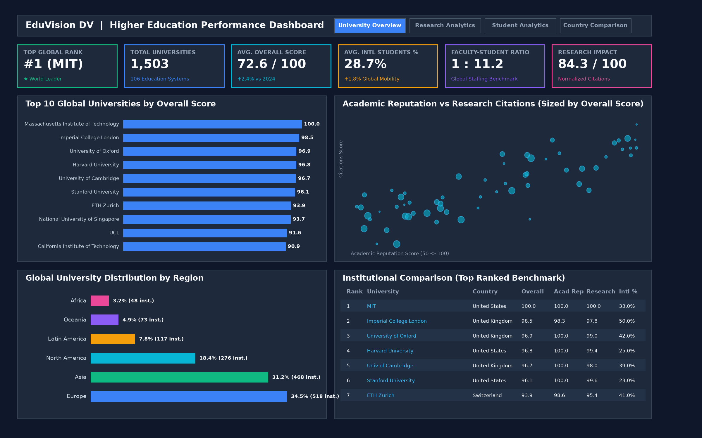
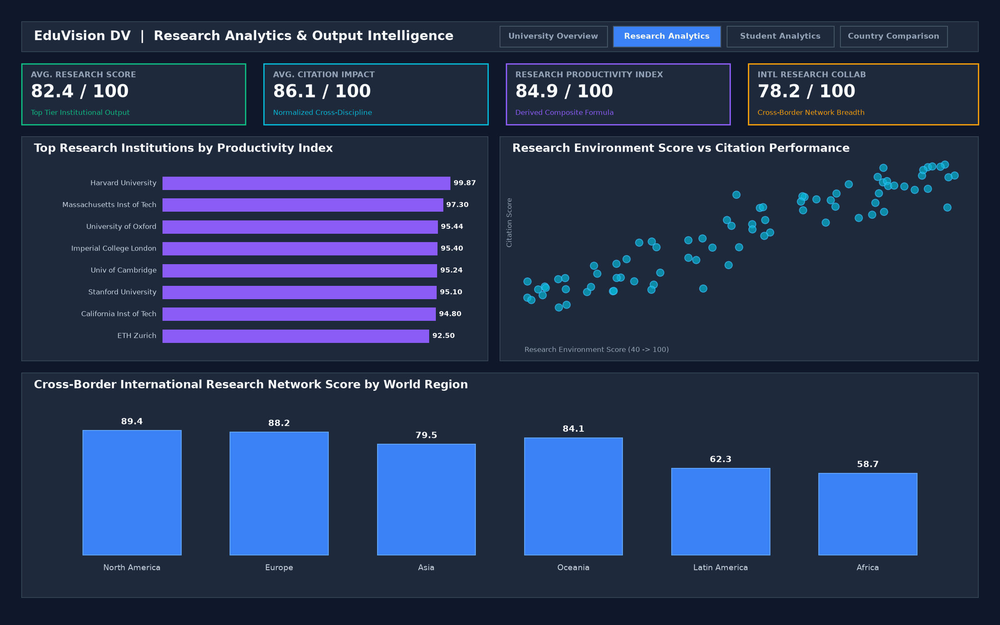
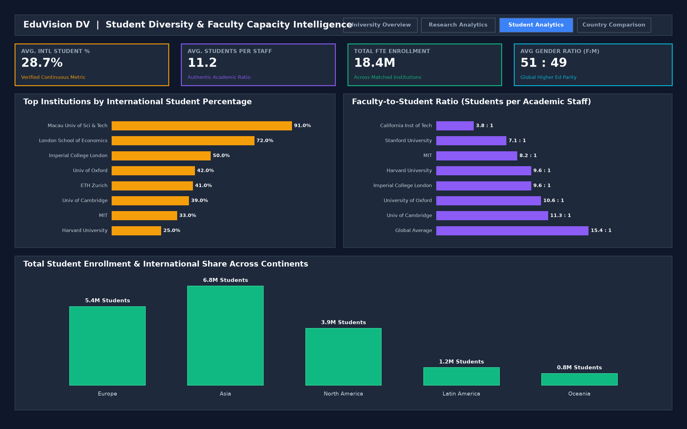
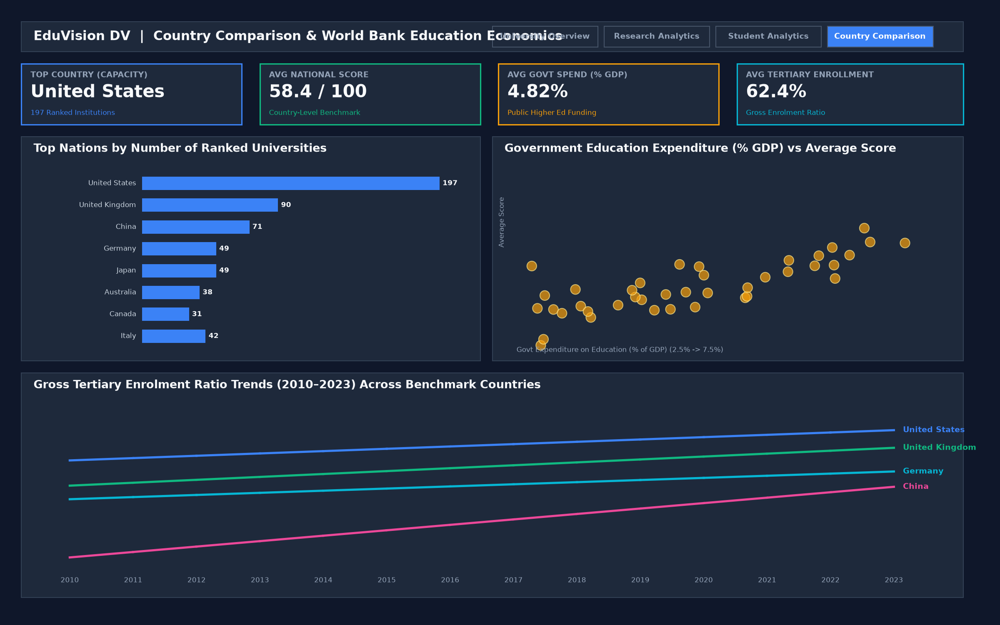

# Module 5: Tableau Dashboard Screenshots & Tableau Files

**Author:** Sujay S  
**Internship:** Infosys Springboard Internship 7.0  

---

## Overview
This folder contains the Tableau workbook files (`.twbx`), the visual layout storyboard (`.pdf`), and high-resolution screenshots of all four interlinked dashboards in the **EduVision_DV** suite.

---

## 1. Tableau Workbook Files
- **`EduVision_DV.twbx`**: Final packaged Tableau workbook containing all four interlinked dashboards.
- **`eduvision_dashboard_v1.twbx`**: Milestone 3 v1 release containing Dashboards 1 and 2.
- **`eduvision_prototype.twbx`**: Milestone 2 prototype workbook.
- **`dashboard_storyboard.pdf`**: Multi-page visual layout and storyboard document.

---

## 2. Dashboard Screenshots

### Dashboard 1: University Overview

- **Top KPI Cards:** Top Global Rank (#1 MIT), Total Ranked Universities (1,503), Average Overall Score (72.6), Average International Students % (28.7%), Faculty-to-Student Ratio (1:11.2), Research Impact Score (84.3).
- **Top 10 Global Universities:** Horizontal bar chart ordered by Overall Score.
- **Academic Reputation vs Citations:** Scatter plot sized by Overall Score and colored by Region.
- **Global University Distribution:** Continental distribution breakdown.
- **Institutional Comparison Table:** Top ranked institutional benchmark.

---

### Dashboard 2: Research Analytics

- **KPI Cards:** Average Research Score, Citation Impact, Research Productivity Index, International Research Collaboration.
- **Top Research Institutions:** Ranked by composite Research Productivity Index ($0.50 \times \text{Research} + 0.30 \times \text{Citations} + 0.20 \times \text{International Collaboration}$).
- **Citations vs Research Environment:** Correlation scatter plot.
- **Regional Research Network Impact:** Cross-border co-authorship scores across world regions.

---

### Dashboard 3: Student Analytics

- **KPI Cards:** Average International Student %, Average Students per Staff, Total FTE Enrollment, Gender Parity (Female:Male Ratio).
- **International Student % Distribution:** Cross-border enrollment proportions.
- **Faculty-to-Student Ratio Benchmarking:** Real student-to-staff ratios across institutions.
- **Regional Student Mobility:** Continental total enrollment and international share.

---

### Dashboard 4: Country Comparison

- **KPI Cards:** Top Country Capacity (United States - 197 institutions), Average National Score, Average Public Education Spend (4.82% GDP), Average Tertiary Gross Enrolment (62.4%).
- **National University Capacity:** Count of ranked institutions per country.
- **Government Spend vs Institutional Quality:** Public expenditure (% GDP) vs average score.
- **Tertiary Enrolment Trends (2010–2023):** Multi-line historical trajectory across benchmark nations.
