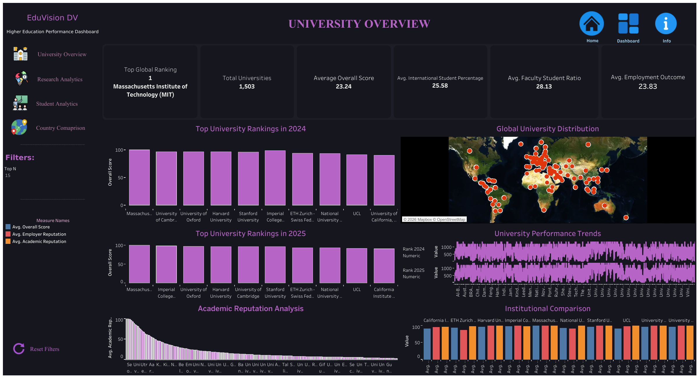
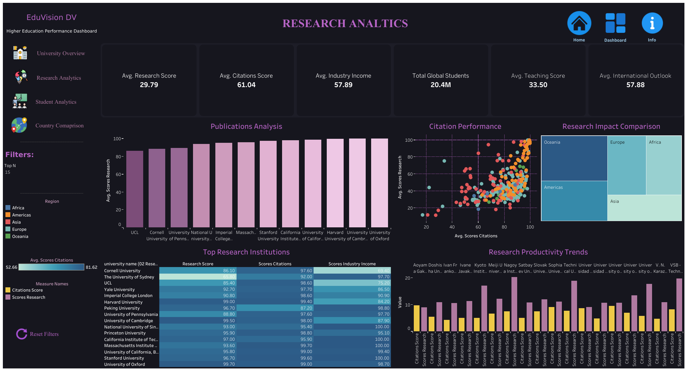
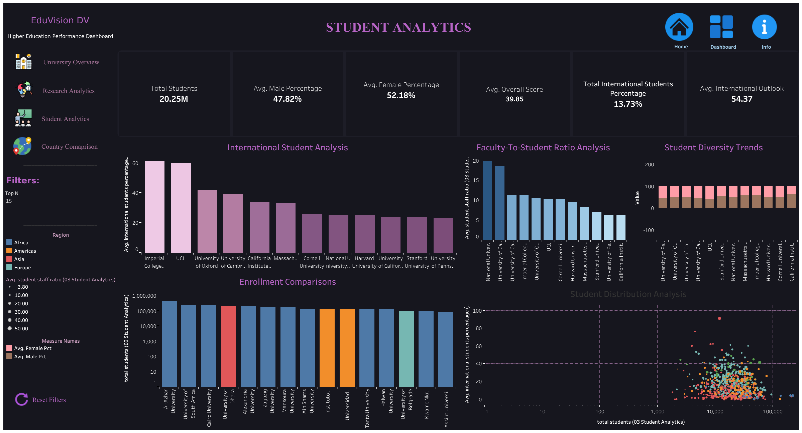
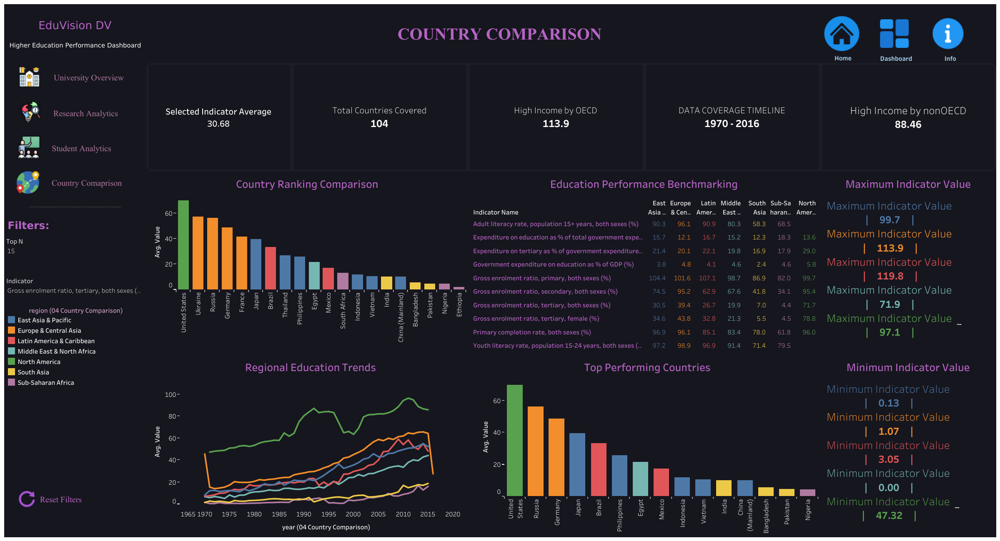
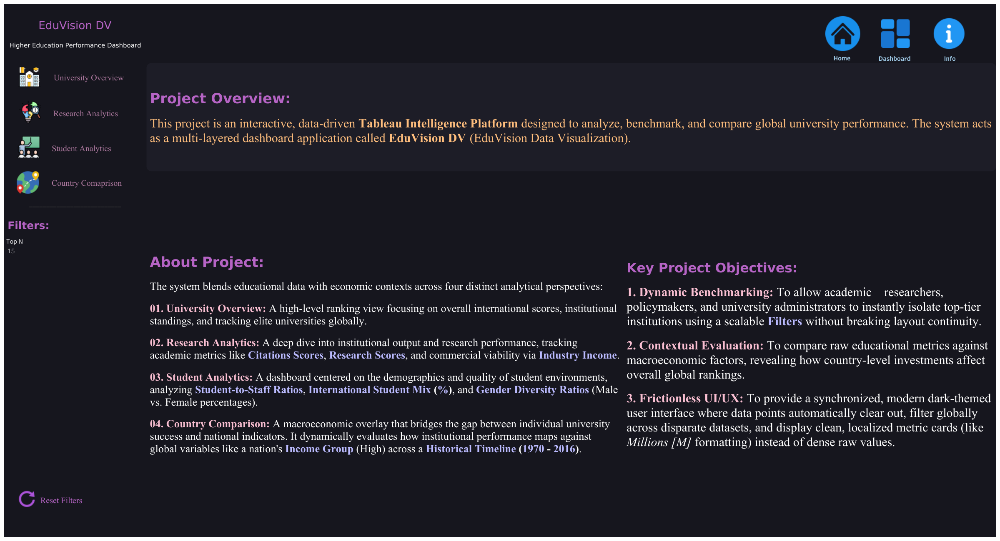

# EduVision DV: Higher Education Performance Dashboard

A higher education analytics project that turns four public ranking and education datasets into one unified Tableau workbook, five dashboards, and a repeatable data pipeline that anyone can re-run and verify.

---



---

## Table of Contents

1. [Project Overview](#1-project-overview)
2. [Data Sources](#2-data-sources)
3. [Data Pipeline](#3-data-pipeline)
4. [Data Model](#4-data-model)
5. [Six Core KPIs](#5-six-core-kpis)
6. [The Five Dashboards](#6-the-five-dashboards)
7. [Filters, Parameters, and Interactions](#7-filters-parameters-and-interactions)
8. [Repository Structure](#8-repository-structure)
9. [Getting Started](#9-getting-started)
10. [Tech Stack](#10-tech-stack)
11. [Testing and Quality Assurance](#11-testing-and-quality-assurance)
12. [Known Limitations](#12-known-limitations)
13. [License and Attribution](#13-license-and-attribution)

---

## 1. Project Overview

EduVision DV analyzes university rankings, research performance, student diversity, academic reputation, and country level education trends, using public datasets from QS, Times Higher Education, and the World Bank.

**Who it is for:**

| Audience | What they use it for |
|---|---|
| Students | Comparing universities before applying |
| Academic researchers | Benchmarking research output and citation impact |
| University administrators | Tracking their institution's position and trend over time |
| Policymakers | Comparing country level education indicators for planning |
| Education consultants | Producing quick, defensible comparisons for clients |

**The deliverable:** a single Tableau packaged workbook (**.twbx**) containing five dashboards, backed by a data pipeline that is documented end to end below, so every number on every dashboard can be traced back to a source file and a transformation step.

---

## 2. Data Sources

| Source | Provider | Raw Shape | Role |
|---|---|---|---|
| QS World University Rankings 2025 | Quacquarelli Symonds | 1,503 rows x 19 cols | Master university dimension, University Overview |
| THE World University Rankings 2024 | Times Higher Education | 867 rows x 27 cols | Primary research metrics, Research Analytics |
| World University Rankings 2023 | Aggregated ranking release | 812 rows x 25 cols | Fallback research metrics and student body data, Student Analytics |
| World Bank Education Statistics (EdStats) | World Bank | 55,918 rows x 8 cols | Country Comparison, long format indicator data |

---

## 3. Data Pipeline

The pipeline runs in six steps, from raw source files to the two final analytical datasets. This section documents the actual pipeline run, with real row counts, so results are reproducible and auditable rather than approximate.

### Step 0: Raw Shapes

The four source files are loaded as is, with no filtering:

```
01 University Overview (Master, QS 2025): 1503 rows x 19 cols
02 Research Analytics (THE 2024)        :  867 rows x 27 cols
03 Student Analytics (WUR 2023)         :  812 rows x 25 cols
04 Country Comparison                   : 55918 rows x 8 cols
```

### Step 1: Fix Master Region Label

The QS 2025 master file is the university dimension every other table keys off. Before anything else, it is checked and corrected for a bad region label:

- 1 row had **region = 'Not Classified'**: **U0206, Eastern Mediterranean University**, country **Northern Cyprus (CY-N)**. Reclassified to **region = 'Asia'** to match its sibling country, Cyprus (CY).
- Duplicate **university_id** in master: **0**
- Duplicate full rows in master: **0**
- Missing values in master: **0**

The master table is treated as the single source of truth for which universities exist in the project. Nothing downstream is allowed to introduce a university that is not already in this table.

### Step 2: Sync All Datasets to the Master Universe

Every other dataset is filtered down to only the universities and countries that exist in the master table, so no dashboard can ever show an institution or country that was not validated in Step 1.

```
02 Research Analytics: 867   -> 867   rows (removed 0 not in master)
03 Student Analytics : 812   -> 812   rows (removed 0 not in master)
04 Country Comparison: 55918 -> 33450 rows (removed 22468 rows for countries outside master)
```

Two master countries have **no indicator data** in Country Comparison: **Northern Cyprus (CY-N)** and **Taiwan (TW)**. These are kept in the master table as is; no values are fabricated to fill the gap. Any Country Comparison chart filtered to one of these two will correctly show no data rather than a made up number.

### Step 3: Cascade Research Metrics (THE 2024 primary, WUR 2023 fallback)

Not every university has a THE 2024 research score. Where it is missing, the pipeline falls back to WUR 2023 instead of leaving the field blank:

```
Universities with THE 2024 data only  : 106
Universities with WUR 2023 data only  :  51
Universities with BOTH (THE preferred): 761
Universities with NEITHER source      : 585   <- excluded, no real research KPI possible
Research metric rows built            : 918   (106 + 51 + 761)
```

585 universities that appear in the master ranking table have no research metric in either source and are therefore **excluded from the Six KPIs dataset and the Final Dataset**. This is a deliberate integrity decision: it is better for a university to be absent from the research facing KPIs than to be shown with a fabricated or estimated score.

### Step 4: Build the "Six KPIs" Dataset

An inner join of the master table with the cascaded research metrics from Step 3:

```
Six KPIs final shape        : 918 rows x 20 cols
Missing values               : 0
Duplicate university_id      : 0
Duplicate full rows          : 0
All university_ids in master?: True

Region breakdown:
  Asia      362
  Europe    307
  Americas  182
  Oceania    37
  Africa     30

research_year breakdown:
  2024   867
  2023    51
```

This is the dataset the six core KPIs (see Section 5) are calculated from. Its 918 rows are exactly the universities that have a verified, real research metric from either THE 2024 or WUR 2023.

### Step 5: Build the "University Final Dataset"

A superset of the Six KPIs dataset that also retains the raw component scores each KPI was built from, rather than only the calculated KPI values:

```
University Final Dataset shape: 918 rows x 20 cols
Missing values                : 0
Duplicate university_id       : 0
Duplicate full rows           : 0
All university_ids in master? : True
```

### Files Written

```
Six KPIs.xlsx
University Final Dataset.xlsx
+ 4 cleaned raw datasets (master, research, student, country)
```

### Pipeline Summary Diagram

```
QS 2025 (master, 1503) ----------------------------------------------+
                                                                       |
THE 2024 (867) --------+                                             |
                        +--> cascade (THE primary, WUR fallback) --> Six KPIs.xlsx (918)
WUR 2023 (812) --------+                                             |
                                                                       |
                                                        University Final Dataset.xlsx (918)

World Bank EdStats (55918) --> synced to master countries --> 33450 rows --> Country Comparison
```

---

## 4. Data Model

| Table | Grain / Key Fields | Row Count | Role |
|---|---|---|---|
| Master (QS 2025) | **university_id**, **country_id**, **region**, **year**, **rank_2024_numeric**, **rank_2025_numeric**, **overall_score** | 1,503 | Central university dimension, hub of the model |
| Six KPIs | **university_id** + 6 calculated KPI fields | 918 | Universities with a verified research metric only |
| University Final Dataset | **university_id** + KPI fields + raw component scores | 918 | Same universe as Six KPIs, with underlying scores retained for audit |
| Country Comparison | **country_id**, **country_name**, **region**, **income_group**, **year**, **indicator_code**, **indicator_name**, **value** | 33,450 | Long format, country level, one row per country/year/indicator |

**Relationship pattern:**

- The Master table is the hub. University Overview reads from it directly and can show all 1,503 ranked universities.
- Six KPIs and University Final Dataset relate to the Master table on **university_id**, but only cover the 918 universities with a real, non fabricated research metric. Research Analytics and any KPI card built from these files reflects that narrower universe, not the full 1,503.
- Country Comparison relates to the Master table many to one on **country_id**, and has no institution level rank field; it stores indicator and value pairs across the 33,450 rows that survived the Step 2 sync.

---

## 5. Six Core KPIs

| KPI | Definition | Built From |
|---|---|---|
| Global Ranking Score | Institution's overall position, from QS 2025 and THE ranking positions | **rank_2024_numeric**, **rank_2025_numeric**, **overall_score** |
| Research Impact Score | Composite of research volume, citation strength, and industry income | **scores_research**, **scores_citations**, **scores_industry_income** |
| Faculty-to-Student Ratio | Students per faculty member, shown as a ratio such as 1 to 17.3 | **student_staff_ratio**, **total_students** |
| International Student Percentage | Share of enrolled students who are international | **international_students_percentage**, **total_students** |
| Academic Reputation Score | Peer survey measure of institutional reputation | **academic_reputation**, **employer_reputation** |
| Research Productivity Index | Research output normalized by institution size | **scores_research**, **total_students** |

KPIs are calculated in Python (pandas and numpy) during Steps 3 to 5 of the pipeline, not as Tableau calculated fields. This keeps the KPI logic version controlled, testable outside of Tableau, and fast to load once in the workbook.

---

## 6. The Five Dashboards

| # | Dashboard | Role | Data Source |
|---|---|---|---|
| 1 | EduVision DV | Home / landing page, global filters and navigation | N/A, control layer |
| 2 | University Overview | Global ranking, KPI summary, distribution | Master (1,503 universities) |
| 3 | Research Analytics | Teaching, research, citations, industry income | Six KPIs / Final Dataset (918 universities) |
| 4 | Student Analytics | Enrollment, diversity, faculty ratio | WUR 2023 (812 universities) |
| 5 | Country Comparison | Country level education indicators over time | Country Comparison (33,450 rows) |

Because University Overview reads from the full 1,503 row master table while Research Analytics reads from the narrower 918 row KPI dataset, it is expected and correct that University Overview can show more universities than Research Analytics for the same filter selection. This is documented behavior, not a data error, see Section 12.

### 6.1 Dashboard Screenshots

**University Overview**


**Research Analytics**



**Student Analytics**



**Country Comparison**



**Info / About**



---

## 7. Filters, Parameters, and Interactions

| Control | Type | Purpose |
|---|---|---|
| Year | Quick filter | Restrict all dashboards to a single reporting year |
| Region | Quick filter | Restrict to one of the world regions, or All |
| Country | Quick filter | Restrict to a single country, or All |
| Subject Area | Quick filter | Restrict Research Analytics content to one subject area, or All |
| Top N | Parameter, slider | Controls how many top ranked universities appear in leaderboard charts |
| Select Education Indicator | Parameter, dropdown | Chooses which World Bank indicator drives Country Comparison |
| DASHBOARDS | Parameter, dropdown | Displays the name of the currently selected destination dashboard |

Dashboard actions link the charts together: selecting a university row filters or highlights related charts on the same dashboard, selecting a region highlights that region across the dashboard, and selecting a country on Country Comparison filters related university level charts where a mapping exists.

---

## 8. Repository Structure

The repository is organized by milestone, each with its own Deliverables folder, plus one shared folder holding the final dimension and fact tables used by the Tableau workbook.

```
Higher-Education-Intelligence-System.../
|-- README.md
|-- LICENSE
|-- .gitignore
|
|-- Dim_&_Fact_Datasets/                 Final dimension and fact tables (Tableau data source)
|   |-- 01_University_Overview/          dim_country.xlsx, dim_university.xlsx, fact_university_overview.xlsx
|   |-- 02_Research_Analytics/           dim_university.xlsx, fact_research_analytics.xlsx
|   |-- 03_Student_Analytics/            dim_university.xlsx, fact_student_analytics.xlsx
|   |-- 04_Country_Comparison/           dim_country.xlsx, dim_indicator.xlsx, fact_country_indicators.xlsx
|   |-- split_qa_log.txt                 QA log from splitting the master pipeline output into dim/fact tables
|
|-- Milestone 01/                        Data Collection and Preparation
|   |-- Script/                          data_collection.py, Executed Script/ (Colab notebook run as PDF)
|   |-- Raw Datasets/                    01 to 04, one folder per dataset, source files as downloaded
|   |-- Deliverables/
|       |-- Module 1/                    data_collection.py, university_raw_data.csv/ (6 source files)
|       |-- Module 2/                    script/education_cleaning.ipynb, university_cleaned.csv/ (4 cleaned files)
|
|-- Milestone 02/                        KPI Engineering and Dashboard Planning
|   |-- KPIs Dataset/                    Six KPIs.xlsx
|   |-- Deliverables/
|       |-- Module 3/                    university_final_dataset.py, university_final_dataset.xlsx
|       |-- Module 4/                    dashboard_storyboard.pdf, eduvision_prototype.mp4, eduvision_prototype.twbx
|
|-- Milestone 03/                        Dashboard Development
|   |-- Deliverables/
|       |-- Module 5/                    Tableau Dashboard Development.pdf, QS and THE Visualisation.pdf, eduvision_dashboard_v1.twbx
|       |-- Module 6/                    EduVision DV.twbx, Sample.png
|
|-- Milestone 04/                        Testing and Delivery
    |-- Deliverables/
        |-- Module 7/                    Dashboard Testing Report.pdf, QA Checklist.pdf
        |-- Module 8/                    EduVision DV.twbx, Final Documentation.pdf, GitHub Repository.md, Tableau Public.md
```

| Location | What It Holds |
|---|---|
| **Dim_&_Fact_Datasets/** | The final, cleaned dimension and fact tables, split by dashboard area, that the Tableau workbook connects to |
| **Milestone 01/** | Raw data collection and cleaning: the collection script, the raw source files, and the cleaned output |
| **Milestone 02/** | KPI engineering and the first clickable prototype: the Six KPIs dataset, the final dataset script, and the storyboard/prototype workbook |
| **Milestone 03/** | Full dashboard build: the working workbook and supporting visualisation reference material |
| **Milestone 04/** | Testing and final delivery: the QA Checklist, the Dashboard Testing Report, the Final Documentation, and the finished workbook, plus links to the GitHub repository and the published Tableau Public view |

The final, presentation ready workbook is **Milestone 04/Deliverables/Module 8/EduVision DV.twbx**. Earlier **.twbx** files inside Milestone 02 and Milestone 03 are working prototypes kept for traceability, not the current version.

---

## 9. Getting Started

1. Clone this repository.
2. Open **Milestone 04/Deliverables/Module 8/EduVision DV.twbx** in Tableau Desktop (2021.1 or later recommended). This is the final workbook.
3. Read **Milestone 04/Deliverables/Module 8/Final Documentation.pdf** for a full guide to every dashboard and KPI.
4. To review testing results, see **Milestone 04/Deliverables/Module 7/QA Checklist.pdf** and **Dashboard Testing Report.pdf** in the same folder.
5. To re-run the pipeline yourself: run **Milestone 01/Script/data_collection.py**, then **Milestone 01/Deliverables/Module 2/script/education_cleaning.ipynb**, then **Milestone 02/Deliverables/Module 3/university_final_dataset.py** in that order. This reproduces the exact row counts documented in Section 3 and writes the tables found in **Dim_&_Fact_Datasets/**.
6. The published, browser viewable version of the dashboard is linked from **Milestone 04/Deliverables/Module 8/Tableau Public.md**.

---

## 10. Tech Stack

| Area | Tools / Libraries |
|---|---|
| Data collection | Python, QS Rankings, World University Rankings, World Bank EdStats |
| Data processing | Pandas, NumPy |
| Data cleaning | Python |
| Visualization | Tableau Desktop, Tableau Public |
| Dashboard integration | Tableau filters, parameters, and dashboard actions |
| Documentation | Markdown, Microsoft Word, GitHub |

---

## 11. Testing and Quality Assurance

- 20 dashboard interaction test cases executed across all 5 dashboards, all passed. Full log in **Milestone 04/Deliverables/Module 7/Dashboard Testing Report.pdf**.
- 1 defect found and resolved during testing: the EduVision DV home dashboard was rendering overlapping charts from multiple dashboards at once due to floating zones with no working visibility rule. Root cause, fix, and retest are documented in the Testing Report.
- Referential integrity validated at every pipeline step: 0 invalid **university_id** values, 0 invalid **country_id** values, 0 duplicate rows, 0 fabricated values used to fill missing data.
- Full checklist in **Milestone 04/Deliverables/Module 7/QA Checklist.pdf**.

---

## 12. Known Limitations

- **918 vs 1,503 universities:** only 918 of the 1,503 master universities have a verified research metric (THE 2024 or WUR 2023) and therefore appear in Research Analytics, the Six KPIs dataset, and the Final Dataset. The other 585 appear only in University Overview, which reads from the full master table. This is intentional, not a defect, see Step 3.
- **Two countries with no indicator data:** Northern Cyprus (CY-N) and Taiwan (TW) exist in the master table but have no rows in Country Comparison. Charts filtered to either will correctly show no data.
- **Leftover draft dashboard tabs:** the workbook still contains a few draft or duplicate dashboard tabs (**COPY dont del**, **Dashboard dont del**, **INFO**, and uppercase duplicates of the four analytical dashboards) that should be removed before external publication. See the pre publish housekeeping section of the QA Checklist.

---

## 13. License and Attribution

Source rankings and indicators are publicly published by QS, Times Higher Education, and the World Bank, and are used here for educational and portfolio purposes. This repository does not claim ownership of the underlying ranking data.
