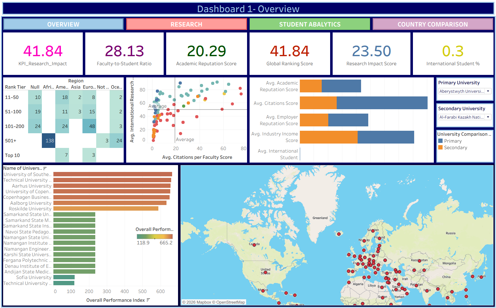
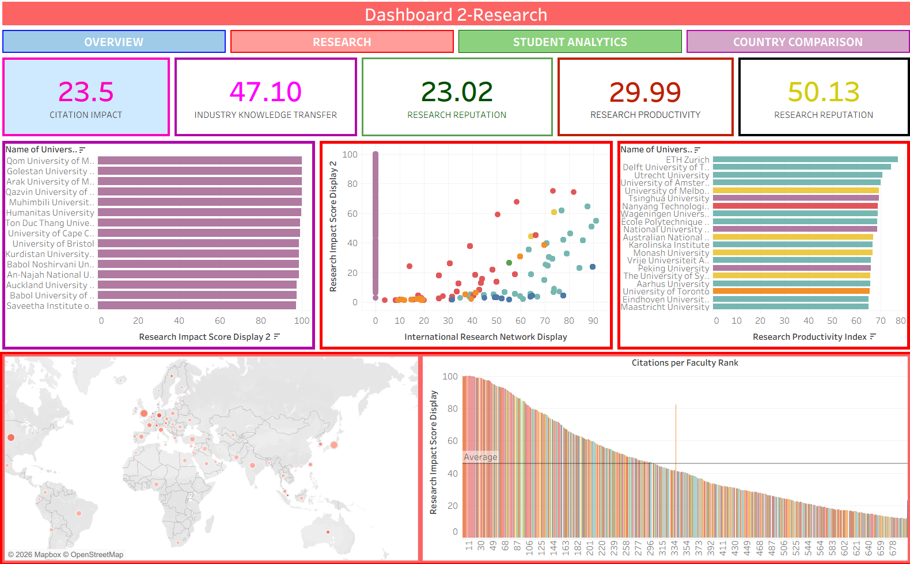
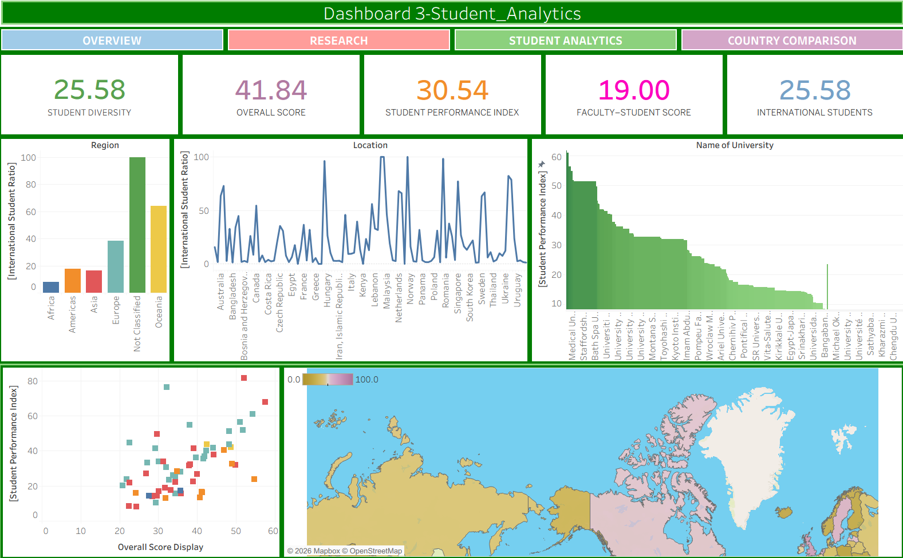
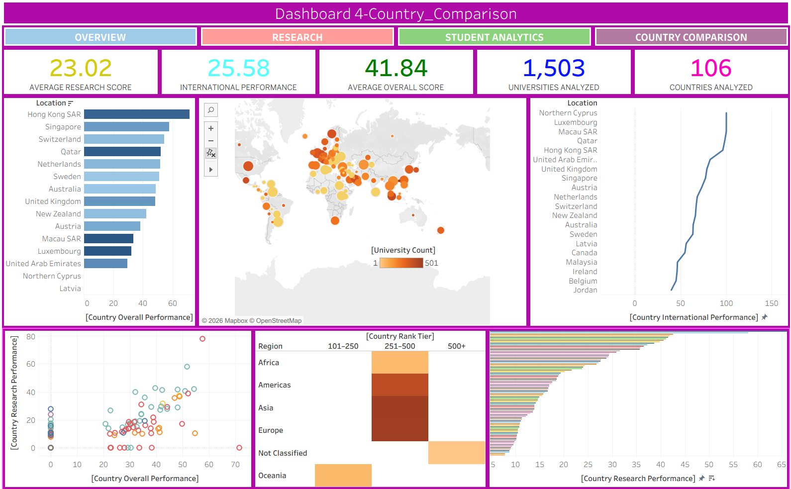

# EduVision DV: Higher Education Performance & Institutional Excellence Intelligence System

An enterprise-grade higher education analytics intelligence system that consolidates four public university ranking and macroeconomic datasets into a Star Schema data model, six engineered core KPIs, an automated data quality validation suite, and an interactive Tableau BI workbook with five analytical dashboards.

---


---

## Table of Contents

1. [Project Overview](#project-overview)
2. [Objective](#objective)
3. [Key Features](#key-features)
4. [Technology Stack](#technology-stack)
5. [Project Architecture](#project-architecture)
   - [Module 1 — Data Ingestion & Cleaning](#module-1--data-ingestion-and-cleaning)
   - [Module 2 — Integration & Data Model](#module-2--integration-and-data-model)
   - [Module 3 — KPI Engineering & Quality Audit](#module-3--kpi-engineering-and-quality-audit)
   - [Module 4 — BI Dashboards & Visualization](#module-4--bi-dashboards-and-visualization)
6. [Data Model & Star Schema](#data-model--star-schema)
7. [Six Core KPIs](#six-core-kpis)
8. [Interactive Dashboards](#interactive-dashboards)
9. [Tableau Dashboard Link](#tableau-dashboard-link)
10. [Dashboard Screenshots](#dashboard-screenshots)
11. [Project Documentation](#project-documentation)
12. [How to Run the Project](#how-to-run-the-project)
13. [Project Structure](#project-structure)
14. [Testing and Quality Assurance](#testing-and-quality-assurance)
15. [License and Attribution](#license-and-attribution)

---

## Project Overview

EduVision DV synthesizes institutional ranking metrics, research citation impact, campus diversity, academic reputation, and national macroeconomic education indicators from QS World University Rankings 2025, Times Higher Education (THE) 2024, World University Rankings (WUR) 2023, and World Bank Education Statistics (EdStats).

### Target Audiences

| Audience | Use Case |
|---|---|
| **Students & Guardians** | Comparing global institutional rankings, academic reputation, and student-faculty ratios before applying. |
| **Academic Researchers** | Benchmarking research volume, citation influence, and international research network engagement. |
| **University Leadership** | Tracking institutional performance trajectories, peer positioning, and faculty capacity over time. |
| **Policy Analysts** | Comparing country-level tertiary education expenditure and indicator trends. |

---

## Objective

The core objective of this project is to eliminate data fragmentation across disparate global university ranking providers by constructing a single source of truth. It provides a transparent, auditable ETL data pipeline from raw source files to normalized Star Schema tables, powering an executive-ready Tableau dashboard workbook.

---

## Key Features

- **Automated Data Pipeline**: End-to-end Python pipeline validating raw schemas, executing text hygiene, and performing crosswalk entity resolution.
- **Multi-Tier Entity Resolution**: 4-tiered crosswalk matching engine assigning surrogate global IDs (`university_id`, `country_id`) across heterogenous datasets without false-positive auto-merges.
- **Enterprise Star Schema**: Normalized dimension tables (`dim_university`, `dim_country`) and fact tables (`fact_university_performance`, `fact_research`, `fact_student`, `fact_country_education`).
- **6 Standardized Core KPIs**: Defensible formulations including a Tri-Pillar Weighted Research Productivity Index without artificial zero-imputations.
- **Automated Data Quality Audit**: 21 integrity and boundary tests asserting 100% referential integrity prior to BI workbook consumption.
- **Interactive BI Workbook**: 5 interactive dashboards in Tableau Desktop with quick filters, parameter sliders, and action highlights.

---

## Technology Stack

- **Data Processing & ETL**: Python 3.x, Pandas, NumPy, RapidFuzz
- **Data Warehousing & Modeling**: SQLite, Star Schema Relational Modeling, Microsoft Excel
- **Business Intelligence & Visualization**: Tableau Desktop, Tableau Public
- **Environment & Automation**: Jupyter Notebooks, Command-Line Automation Scripts
- **Documentation & Presentation**: Markdown, Microsoft PowerPoint

---

## Project Architecture

The project is structured into **4 functional core modules** supported by a dedicated **documentation** folder.

```text
EduVision_DV/
├── 01_Data_Ingestion_and_Cleaning/
├── 02_Integration_and_Data_Model/
├── 03_KPI_Engineering_and_Quality_Audit/
├── 04_BI_Dashboards_and_Visualization/
└── documentation/
```

### Module 1 — Data Ingestion and Cleaning (`01_Data_Ingestion_and_Cleaning/`)
Handles baseline data validation, raw schema inspection, text hygiene, header standardization (`snake_case`), string numeric parsing, and missing value logging without modifying raw source files.

### Module 2 — Integration and Data Model (`02_Integration_and_Data_Model/`)
Builds multi-tier entity resolution crosswalks, assigns global surrogate primary keys (`university_id`, `country_id`), and constructs normalized Star Schema dimension and fact tables.

### Module 3 — KPI Engineering and Quality Audit (`03_KPI_Engineering_and_Quality_Audit/`)
Calculates six core institutional KPIs (including the Tri-Pillar Research Productivity Index) and runs 21 automated quality assurance constraint checks, generating `ready_for_tableau.txt`.

### Module 4 — BI Dashboards and Visualization (`04_BI_Dashboards_and_Visualization/`)
Hosts the final Tableau packaged workbook (`.twbx`), workbook XML definitions (`.twb`), and detailed step-by-step dashboard build guides.

---

## Data Model & Star Schema

The data model uses a Star Schema architecture centered on surrogate keys `university_id` and `country_id`:

| Table Name | Grain / Primary Key | Role |
|---|---|---|
| `dim_university` | `university_id` (2,735 rows) | Master institutional dimension |
| `dim_country` | `country_id` (152 rows) | Country dimension |
| `fact_university_performance` | `(university_id, year)` | Global ranks, overall scores, reputation |
| `fact_research` | `(university_id, year)` | Research scores, citations, industry income |
| `fact_student` | `(university_id, year)` | Enrollment, international ratios, staff ratio |
| `fact_country_education` | `(country_id, year, indicator)` | World Bank education expenditure indicators |

---

## Six Core KPIs

1. **Global Ranking Score**: Direct overall institutional ranking position and score [0–100].
2. **Research Impact Score**: Citation influence and scholarly footprint per faculty member [0–100].
3. **Faculty-to-Student Ratio**: Direct staff capacity (students per faculty member).
4. **International Student Percentage**: Share of enrolled students who are international (%).
5. **Academic Reputation Score**: Peer academic survey perception score [0–100].
6. **Research Productivity Index**: Composite index ($0.40 \cdot \text{Research} + 0.40 \cdot \text{Citations} + 0.20 \cdot \text{International Network}$).

---

## Interactive Dashboards

The Tableau workbook provides 5 interactive dashboard views:

1. **EduVision DV**: Master landing page and navigation hub.
2. **University Overview**: Global ranking leaderboards, KPI summary cards, reputation radar charts.
3. **Research Analytics**: Citations vs research volume scatter plots and subject breakdowns.
4. **Student Analytics**: Campus internationalization maps and staff ratio distribution histograms.
5. **Country Comparison**: National higher education sector heatmaps and World Bank expenditure trends.

---

## Tableau Dashboard Link

Explore the live interactive dashboard on Tableau Public:

👉 **[EduVision Interactive Tableau Public Dashboard](https://public.tableau.com/app/profile/aditya.singh5145/viz/Infosys_Edu_Vision/Dashboard1-Overview?publish=yes)**

---

## Dashboard Screenshots

### 1. Overview Dashboard


### 2. Research Analytics Dashboard


### 3. Student Analytics Dashboard


### 4. Country Comparison Dashboard


---

## Project Documentation

All non-code presentation and documentation materials are located in the top-level `documentation/` folder:

- **Presentation (`documentation/PPT/`)**: Project presentation slide deck (`Presentation.pptx.pdf`).
- **Tableau Documentation (`documentation/Tableau/`)**: `Tableau_Dashboard.md` containing the live dashboard URL and visual details.
- **Screenshots (`documentation/Screenshots/`)**: Visual preview gallery of all dashboard views.
- **Documentation Index**: `documentation/README.md` detailing all assets.

---

## How to Run the Project

### 1. Re-running the Data Pipeline

Execute the modules sequentially from the project root:

```bash
# Step 1: Data Ingestion & Cleaning
python 01_Data_Ingestion_and_Cleaning/scripts/profile_data.py
python 01_Data_Ingestion_and_Cleaning/scripts/clean_datasets.py

# Step 2: Integration & Data Model
python 02_Integration_and_Data_Model/scripts/build_standardization_pipeline.py
python 02_Integration_and_Data_Model/scripts/build_university_crosswalk.py
python 02_Integration_and_Data_Model/scripts/build_analytical_data_model.py
python 02_Integration_and_Data_Model/scripts/build_final_fact_tables.py

# Step 3: KPI Engineering & Quality Audit
python 03_KPI_Engineering_and_Quality_Audit/scripts/engineer_kpis.py
python 03_KPI_Engineering_and_Quality_Audit/scripts/audit_data_quality.py
```

### 2. Viewing Tableau Dashboards

1. Open `04_BI_Dashboards_and_Visualization/EduVision_Module2_Cleaning.twbx` or `Infosys_Edu_Vision.twb` in Tableau Desktop (2021.1+).
2. Inspect the interactive dashboards and filters.

---

## Project Structure

```text
EduVision_DV/
│
├── 01_Data_Ingestion_and_Cleaning/
│   ├── data/
│   │   ├── raw/
│   │   ├── cleaned/
│   │   ├── processed/
│   │   └── validation/
│   ├── notebooks/
│   │   └── 02_data_cleaning.ipynb
│   ├── reports/
│   │   ├── dataset_validation_report.csv
│   │   ├── dataset_validation_report.md
│   │   ├── dataset_profile.json
│   │   └── cleaning_log.md
│   ├── scripts/
│   │   ├── profile_data.py
│   │   └── clean_datasets.py
│   └── README.md
│
├── 02_Integration_and_Data_Model/
│   ├── data/
│   │   ├── final/
│   │   └── warehouse/
│   ├── notebooks/
│   │   ├── 03_standardization_and_ids.ipynb
│   │   └── 04_kpi_engineering_and_final_data.ipynb
│   ├── reports/
│   │   └── final_data_model_validation.csv
│   ├── scripts/
│   │   ├── build_standardization_pipeline.py
│   │   ├── build_university_crosswalk.py
│   │   ├── build_analytical_data_model.py
│   │   └── build_final_fact_tables.py
│   └── README.md
│
├── 03_KPI_Engineering_and_Quality_Audit/
│   ├── notebooks/
│   │   └── 04_kpi_engineering.ipynb
│   ├── reports/
│   │   ├── kpi_summary_report.md
│   │   ├── kpi_validation_report.csv
│   │   ├── final_data_quality_report.csv
│   │   ├── final_data_quality_report.md
│   │   └── ready_for_tableau.txt
│   ├── scripts/
│   │   ├── engineer_kpis.py
│   │   └── audit_data_quality.py
│   └── README.md
│
├── 04_BI_Dashboards_and_Visualization/
│   ├── Dim_&_Fact_Datasets/
│   ├── UNIVERSITY_OVERVIEW/
│   ├── RESEARCH_ANALYTICS/
│   ├── STUDENT_ANALYTICS/
│   ├── COUNTRY_COMPARISON/
│   ├── Infosys_Edu_Vision.twb
│   ├── EduVision_Module2_Cleaning.twbx
│   └── README.md
│
└── documentation/
    ├── PPT/
    │   └── Presentation.pptx.pdf
    ├── Tableau/
    │   └── Tableau_Dashboard.md
    ├── Screenshots/
    │   ├── Overview.png
    │   ├── Research.png
    │   ├── Student_analytic.png
    │   └── Country_comparison.png
    ├── scripts/
    └── README.md
```

---

## Testing and Quality Assurance

- Executed 21 automated quality assurance tests covering primary key uniqueness, foreign key constraint integrity, temporal boundary checks, and KPI metric ranges.
- Result: **21 PASSED, 0 FAILED**. Output recorded in `03_KPI_Engineering_and_Quality_Audit/reports/ready_for_tableau.txt`.

---

## License and Attribution

Source rankings and education indicators are publicly published by QS, Times Higher Education, and the World Bank, used here for educational and analytical portfolio purposes.
