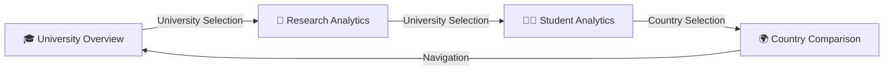
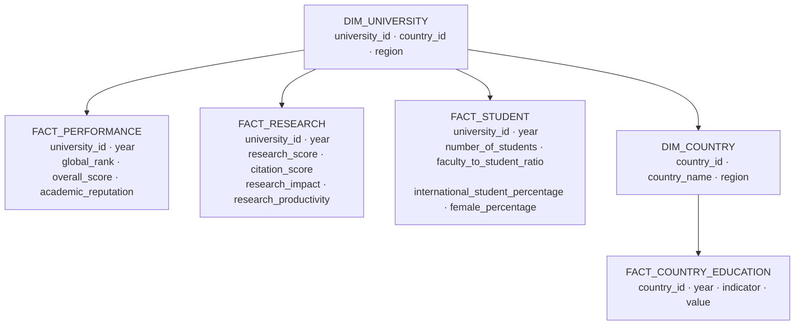
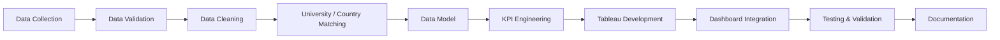
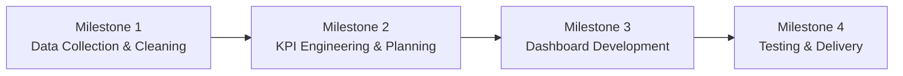

<div align="center">

# 🎓 EduVision\_DV

### Higher Education Performance & Intelligence Dashboard

*An interactive Tableau-based higher-education analytics system for university performance, research analytics, student insights, and country-level education benchmarking.*

[](https://public.tableau.com/app/profile/sweta.mondal1173/viz/EduVision_DV_1/UniversityOverview?publish=yes)
[](https://www.python.org/)
[](https://pandas.pydata.org/)
[](https://www.tableau.com/)

</div>

---

## 🚀 Live Dashboard

> **📊 [Open EduVision\_DV on Tableau Public](https://public.tableau.com/app/profile/sweta.mondal1173/viz/EduVision_DV_1/UniversityOverview?publish=yes)**

The final Tableau workbook is published as a fully interactive Tableau Public dashboard suite.

---

## 📊 Project Overview

EduVision\_DV transforms publicly available higher-education datasets into a structured analytical model and a unified Tableau dashboard suite.

The project analyses:

| Area | Focus |
|------|-------|
| 🎓 **University Rankings** | Institutional performance and global rankings |
| 🔬 **Research Performance** | Research impact, citations, and productivity |
| 👩‍🎓 **Student Characteristics** | Diversity, internationalization, and enrollment |
| 🌍 **International Students** | International student participation rates |
| 🏫 **Faculty & Enrollment** | Faculty-to-student ratios and enrollment trends |
| 🌎 **Country Benchmarking** | Country-level education performance |
| 📈 **Regional Trends** | Regional education trend analysis |

The final deliverable is a single Tableau workbook containing **four interconnected dashboards**.

---

## 🧭 Dashboard Suite


```mermaid
flowchart LR
    A["🎓 University Overview"]
    -->|University Selection| B["🔬 Research Analytics"]
    B -->|University Selection| C["👩‍🎓 Student Analytics"]
    C -->|Country Selection| D["🌍 Country Comparison"]
    D -->|Navigation| A
```

### 1. 🎓 University Overview
**Purpose:** Institutional performance and university-level benchmarking

| KPI Cards | Key Visualizations |
|-----------|-------------------|
| Total Universities | Top University Rankings |
| Average Global Ranking Score | Global University Distribution |
| Average Overall Score | Academic Reputation Analysis |
| Total Countries | University Performance Trends · Institutional Comparison |

---

### 2. 🔬 Research Analytics
**Purpose:** Research performance, citation impact, and productivity analysis

| KPI Cards | Key Visualizations |
|-----------|-------------------|
| Average Research Impact Score | Top Research Institutions |
| Average Citations Score | Research Impact Comparison |
| Average Research Productivity | Research Output Analysis |
| Average Research Score | Citation Performance · Research Productivity Trends |

> **Methodology note:** The finalized dataset does not contain an actual publication-count field. Research Output Analysis uses the available Research Score as a transparent proxy rather than fabricating publication counts.

---

### 3. 👩‍🎓 Student Analytics
**Purpose:** Student population, internationalization, diversity, enrollment, and faculty-to-student analysis

| KPI Cards | Key Visualizations |
|-----------|-------------------|
| Average International Student Percentage | International Student Analysis |
| Average Faculty-to-Student Ratio | Faculty-to-Student Ratio Analysis |
| Average Female Percentage | Student Diversity Trends |
| Average Number of Students | Enrollment Comparisons · Student Distribution Analysis |

---

### 4. 🌍 Country Comparison
**Purpose:** Country-level education benchmarking and regional analysis

| KPI Cards | Key Visualizations |
|-----------|-------------------|
| Average Global Ranking Score | Country Ranking Comparison |
| Average Overall Score | Education Performance Benchmarking |
| Average Research Impact Score | Regional Education Trends |
| Average International Student Percentage | Top Performing Countries · University Distribution |

**Interactive Parameter — Performance Metric:**
```
Performance Metric
├── Ranking Score
├── Overall Score
└── Research Impact Score
```

---

## 🔑 Key Performance Indicators

EduVision\_DV uses **six major education KPIs**, each mapped to a defensible source field and validated before dashboard development:

| # | KPI | Purpose |
|---|-----|---------|
| 1 | **Global Ranking Score** | Normalized university ranking performance (0–100) |
| 2 | **Research Impact Score** | Research and citation influence (0–100) |
| 3 | **Faculty-to-Student Ratio** | Faculty-student relationship (ratio) |
| 4 | **International Student Percentage** | International student participation (%) |
| 5 | **Academic Reputation Score** | Academic reputation via QS survey (0–100) |
| 6 | **Research Productivity Index** | Normalized research productivity composite (0–100) |

> Detailed definitions, source fields, and calculation methods: [`Milestone4/KPI_Defination.md`](Milestone4/KPI_Defination.md)

---

## 🏗️ Data Architecture


```mermaid
flowchart TB
    U["DIM_UNIVERSITY
    university_id · country_id · region"]

    P["FACT_PERFORMANCE
    university_id · year
    global_rank · overall_score · academic_reputation"]

    R["FACT_RESEARCH
    university_id · year
    research_score · citation_score
    research_impact · research_productivity"]

    S["FACT_STUDENT
    university_id · year
    number_of_students · faculty_to_student_ratio
    international_student_percentage · female_percentage"]

    C["DIM_COUNTRY
    country_id · country_name · region"]

    CE["FACT_COUNTRY_EDUCATION
    country_id · year · indicator · value"]

    U --> P
    U --> R
    U --> S
    U --> C
    C --> CE
```

**Common identifiers across all tables:** `university_id` · `country_id` · `year`

> University Name alone is **not** used as the primary relationship key. The structured model avoids large many-to-many joins that can multiply rows and produce incorrect aggregations.

---

## 🔄 Project Workflow


```mermaid
flowchart LR
    A[Data Collection] --> B[Data Validation]
    B --> C[Data Cleaning]
    C --> D[University / Country Matching]
    D --> E[Data Model]
    E --> F[KPI Engineering]
    F --> G[Tableau Development]
    G --> H[Dashboard Integration]
    H --> I[Testing & Validation]
    I --> J[Documentation]
```

```
Collect → Validate → Clean → Match → Model → Engineer → Visualize → Integrate → Test → Document
```

---

## 🗂️ Project Milestones


```mermaid
flowchart LR
    M1["Milestone 1\nData Collection & Cleaning"]
    M2["Milestone 2\nKPI Engineering & Planning"]
    M3["Milestone 3\nDashboard Development"]
    M4["Milestone 4\nTesting & Delivery"]
    M1 --> M2 --> M3 --> M4
```

| Milestone | Focus | Key Deliverables |
|-----------|-------|-----------------|
| **Milestone 1** | Data Collection & Preparation | `data_collection.py` · `education_cleaning.ipynb` · `university_cleaned.csv` |
| **Milestone 2** | KPI Engineering & Dashboard Planning | `generate_education_kpis.py` · `university_final_dataset.xlsx` · `eduvision_prototype.twbx` |
| **Milestone 3** | Dashboard Development | `EduVision_DV_1.twbx` |
| **Milestone 4** | Testing, Documentation & Delivery | QA Checklist · Dashboard Testing Report · All reference documents |

---

## 🛠️ Technology Stack

| Area | Technology |
|------|-----------|
| Data Collection | Python |
| Data Processing | Pandas · NumPy |
| Data Cleaning | Python / Pandas |
| KPI Engineering | Python |
| Visualization | Tableau Desktop |
| Dashboard Integration | Tableau Filters · Parameters · Actions |
| Documentation | Markdown |
| Version Control | Git / GitHub |
| Dashboard Publishing | Tableau Public |

---

## 📁 Repository Structure

```text
EduVision_DV/
│
├── data/
│   └── raw/
│       ├── QS World University Rankings 2025 (Top global universities).csv
│       ├── TIMES_WorldUniversityRankings_2024.csv
│       ├── World University Rankings 2023.csv
│       └── world_bank_education/
│
├── Milestone1/
│   ├── data_collection.py
│   ├── university_raw_data.csv
│   ├── education_cleaning.ipynb
│   └── university_cleaned.csv
│
├── Milestone2/
│   ├── generate_education_kpis.py
│   ├── university_final_dataset.xlsx
│   ├── dashboard_storyboard.pdf
│   └── eduvision_prototype.twbx
│
├── Milestone3/
│   ├── eduvision_prototype_v1.twbx
│   └── EduVision_DV_1.twbx
│
├── Milestone4/
│   ├── QA_Checklist.md
│   ├── Dashboard_Testing_Report.md
│   ├── Data_Sources.md
│   ├── KPI_Defination.md
│   ├── Dashboard_guide.md
│   ├── Education_Analytics_Methodology.md
│   ├── Project_Structure.md
│   └── Final_Documentation.md
│
├── Final Project/
│   └── Tableau_Public_Link.md
│
└── README.md
```

> The repository uses a **Milestone 1–4 top-level structure**. No Module subfolders are required.

---

## 🧪 Testing & Validation

Module 7 validation covered all major testing areas:

| Category | Items Validated |
|----------|----------------|
| **Data** | University IDs · Country IDs · University-country relationships · Year values · Missing values · Duplicate records |
| **KPI** | Source fields · Calculations · Ranking logic · Value ranges · Units |
| **Dashboard** | Filters · Navigation · Dashboard actions · University & country linking · Parameter actions · Filter clearing |

**Final result:** ✅ PASS — 6/6 KPI checks passed (100%) · No major dashboard issues identified

> Detailed reports: [`Milestone4/QA_Checklist.md`](Milestone4/QA_Checklist.md) · [`Milestone4/Dashboard_Testing_Report.md`](Milestone4/Dashboard_Testing_Report.md)

---

## 📚 Documentation

| Document | Purpose |
|----------|---------|
| [`Data_Sources.md`](Milestone4/Data_Sources.md) | Dataset sources, Kaggle URLs, and field references |
| [`KPI_Defination.md`](Milestone4/KPI_Defination.md) | KPI definitions, formulas, and missing-value policy |
| [`Dashboard_guide.md`](Milestone4/Dashboard_guide.md) | Dashboard usage and navigation guide |
| [`Education_Analytics_Methodology.md`](Milestone4/Education_Analytics_Methodology.md) | End-to-end analytics methodology |
| [`Project_Structure.md`](Milestone4/Project_Structure.md) | Repository organization reference |
| [`QA_Checklist.md`](Milestone4/QA_Checklist.md) | Module 7 QA test results |
| [`Dashboard_Testing_Report.md`](Milestone4/Dashboard_Testing_Report.md) | Full dashboard testing report |
| [`Final_Documentation.md`](Milestone4/Final_Documentation.md) | Complete project reference document |

---

## ⚠️ Important Methodology Rules

- Raw datasets are **never overwritten**
- Aggressive fuzzy matching is **not used** to artificially inflate match rates
- A score is **not treated as** a percentage or ratio
- Unrelated fields are **not used** as KPI substitutes
- University Name alone is **not used** as a primary key — `university_id`, `country_id`, and `year` are used
- Large many-to-many joins are **avoided**
- Metrics unavailable in source data are **not fabricated**
- Missing KPI values are **not treated as zero**
- Research Score is used as a **transparent proxy** for Research Output Analysis (no publication-count field exists in the dataset)

---

## 📌 Final Tableau Deliverable

| | |
|-|-|
| **Workbook** | `EduVision_DV_1.twbx` |
| **Dashboards** | 🎓 University Overview → 🔬 Research Analytics → 👩‍🎓 Student Analytics → 🌍 Country Comparison |
| **Integration** | Filters + Navigation + Dashboard Actions + Parameters |
| **Published** | [Tableau Public](https://public.tableau.com/app/profile/sweta.mondal1173/viz/EduVision_DV_1/UniversityOverview?publish=yes) |

---

## 🚀 Deployment

### Tableau Public
The final workbook is published and publicly accessible:

**🔗 [https://public.tableau.com/app/profile/sweta.mondal1173/viz/EduVision\_DV\_1/UniversityOverview?publish=yes](https://public.tableau.com/app/profile/sweta.mondal1173/viz/EduVision_DV_1/UniversityOverview?publish=yes)**

### GitHub
The project is organized as a milestone-based repository containing data collection and cleaning scripts, KPI engineering code, Tableau workbooks, testing reports, and full project documentation.

---

## 🎯 Project Outcome

```
Data Engineering  +  KPI Engineering  +  Tableau Visualization
+  Dashboard Integration  +  Testing & Validation  +  Documentation
                              ↓
              Higher-Education Intelligence System
```

The result is a unified dashboard suite for exploring university performance, research output, student characteristics, and country-level education trends — validated and fully documented.

---

## 📈 Portfolio Highlights

This project demonstrates practical experience across the full analytics lifecycle:

| Skill Area | Demonstrated Through |
|------------|---------------------|
| Data collection & preprocessing | `data_collection.py` · `education_cleaning.ipynb` |
| Data validation & cleaning | Milestone 1 pipeline |
| University & country standardization | Cross-dataset name matching |
| KPI engineering | `generate_education_kpis.py` · 6 validated KPIs |
| Analytical data modelling | Structured fact/dimension model |
| Tableau dashboard development | 4 interconnected dashboards |
| Interactive filters & parameters | Performance Metric parameter |
| Dashboard actions & navigation | Full linking and navigation loop |
| Data visualization | 20 visuals across 4 dashboards |
| Testing & QA | Module 7 — 51 tests, 100% pass rate |
| Technical documentation | 8 Milestone 4 reference documents |
| Tableau Public deployment | Live published dashboard |

---

<div align="center">

## 🎓 EduVision\_DV

### Higher Education Performance & Intelligence Dashboard

*Transforming higher-education data into interactive analytical insights.*

**Built with Python + Pandas + Tableau**

[](https://public.tableau.com/app/profile/sweta.mondal1173/viz/EduVision_DV_1/UniversityOverview?publish=yes)

</div>
